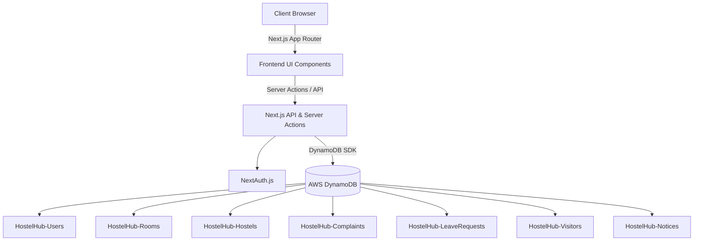

# HostelHub

HostelHub is a modern, comprehensive Hostel Management System built with Next.js 14, React, Tailwind CSS, and AWS DynamoDB. It streamlines hostel operations by handling room allocation, complaints, leave requests, visitor passes, and emergency alerts.

## 🏗 Architecture Diagram



## 🚀 Setup Guide

### Prerequisites
- Node.js 18.x or later
- An AWS Account with DynamoDB access
- AWS CLI configured locally (for local development)

### Local Development
1. Clone the repository:
   ```bash
   git clone https://github.com/your-username/hostelhub.git
   cd hostelhub
   ```
2. Install dependencies:
   ```bash
   npm install
   ```
3. Set up your environment variables (see below).
4. Run the development server:
   ```bash
   npm run dev
   ```
5. Open [http://localhost:3000](http://localhost:3000) with your browser.

## 🗄 AWS DynamoDB Configuration Guide

HostelHub relies entirely on DynamoDB for data persistence. You will need to create the following tables in your AWS Console (Primary Key is `id` of type String for all tables):

1. **HostelHub-Users**
2. **HostelHub-Hostels**
3. **HostelHub-Rooms**
4. **HostelHub-Complaints**
5. **HostelHub-LeaveRequests**
6. **HostelHub-Visitors**
7. **HostelHub-Notices**
8. **HostelHub-EmergencyAlerts**

*Note: For the MVP, Secondary Indexes (GSIs) are omitted in favor of simple queries and scans, but creating GSIs on fields like `studentId` and `hostelId` is highly recommended for production.*

## 🔑 Environment Variables Documentation

Create a `.env.local` file in the root of your project:

```env
# Next Auth Configuration
NEXTAUTH_URL=http://localhost:3000
NEXTAUTH_SECRET=your_super_secret_key_here

# AWS Configuration
AWS_REGION=us-east-1
AWS_ACCESS_KEY_ID=your_aws_access_key
AWS_SECRET_ACCESS_KEY=your_aws_secret_key

# DynamoDB Table Names (Optional, defaults to these values)
DYNAMODB_TABLE_USERS=HostelHub-Users
DYNAMODB_TABLE_HOSTELS=HostelHub-Hostels
DYNAMODB_TABLE_ROOMS=HostelHub-Rooms
DYNAMODB_TABLE_COMPLAINTS=HostelHub-Complaints
DYNAMODB_TABLE_LEAVES=HostelHub-LeaveRequests
DYNAMODB_TABLE_VISITORS=HostelHub-Visitors
DYNAMODB_TABLE_NOTICES=HostelHub-Notices
DYNAMODB_TABLE_EMERGENCY_ALERTS=HostelHub-EmergencyAlerts
```

## 🌐 API Documentation

HostelHub primarily utilizes **Next.js Server Actions** for internal mutations, but exposes the following standard REST APIs:

### `GET /api/analytics`
Fetches a comprehensive aggregate of all system statistics for the Admin Dashboard.
- **Response**: `200 OK`
- **Body**: 
  ```json
  {
    "kpis": {
      "totalStudents": 150,
      "totalRooms": 60,
      "occupiedRooms": 45,
      "pendingComplaints": 12,
      "activeVisitors": 5
    },
    "charts": {
      "hostelOccupancy": [...],
      "complaintTrends": [...],
      "leaveStats": [...],
      "visitorStats": [...]
    }
  }
  ```
- **Auth required**: Admin Session

### `GET /api/seed`
Injects sample demo data into the configured DynamoDB tables.
- **Response**: `200 OK`
- **Note**: *For hackathon/demo purposes only. Remove before production deployment.*

## 🚢 Deployment Guide (Vercel)

HostelHub is optimized for seamless deployment on Vercel.

1. Push your code to a GitHub repository.
2. Log into [Vercel](https://vercel.com/) and click **Add New Project**.
3. Import your GitHub repository.
4. In the **Environment Variables** section, copy and paste all the variables from your `.env.local` file.
5. Ensure the Framework Preset is set to **Next.js**.
6. Click **Deploy**.

Vercel will automatically build the project and assign a production URL. Ensure your AWS credentials have the correct IAM permissions for DynamoDB access.


# 🏠 HostelHub

> **Smart Hostel Management with Seamless Room Allocation, Digital Requests, and Real-Time Administration**

HostelHub is a modern full-stack hostel management platform designed to simplify and digitize hostel operations for educational institutions and private hostels. The platform provides dedicated dashboards for **Students**, **Wardens**, and **Administrators**, enabling efficient management of room allocation, complaints, leave requests, visitor approvals, notices, analytics, and hostel administration through a secure, role-based system.

Built with **Next.js**, **AWS DynamoDB**, and **Vercel**, HostelHub delivers a responsive, scalable, and production-ready solution that replaces traditional paper-based hostel management with an intuitive digital experience.

---

# 🚀 Features

## 👨‍🎓 Student Portal

* Secure Login & Authentication
* Personal Dashboard
* View Hostel & Room Information
* Submit Maintenance Complaints
* Track Complaint Status
* Apply for Leave
* View Leave History
* Visitor Pass Requests
* View Visitor Pass
* Hostel Notice Board
* Profile Management
* Notification Preferences
* Emergency Alert Button

---

## 👮 Warden Portal

* Warden Dashboard
* Student Management
* Complaint Management
* Leave Approval System
* Visitor Approval
* Publish Notices
* Emergency Alert Monitoring
* Hostel Statistics

---

## 👨‍💼 Admin Portal

* Admin Dashboard
* Hostel Management
* Room Management
* Student Management
* Warden Management
* Room Allocation
* Analytics Dashboard
* System Settings

---

# 📊 Core Modules

* Authentication & Authorization
* Role-Based Access Control
* Student Management
* Hostel Management
* Room Allocation
* Complaint Management
* Leave Management
* Visitor Management
* Notice Management
* Analytics Dashboard
* Profile Management
* Settings
* Responsive UI

---

# 🛠 Technology Stack

### Frontend

* Next.js 15 (App Router)
* React
* TypeScript
* Tailwind CSS
* shadcn/ui
* Lucide React
* Framer Motion

### Backend

* Next.js API Routes
* Node.js
* REST APIs

### Authentication

* NextAuth.js

### Database

* AWS DynamoDB
* AWS SDK v3

### Deployment

* Vercel

### Development

* Git
* GitHub
* npm

---

# 📂 Project Structure

```text
app/
 ├── admin/
 ├── student/
 ├── warden/
 ├── api/
 ├── auth/
 ├── login/
 ├── signup/

components/
 ├── ui/
 ├── dashboard/
 ├── forms/
 ├── layout/

lib/
 ├── dynamodb/
 ├── auth/
 ├── utils/

hooks/

public/

styles/

types/
```

---

# 👥 User Roles

## Student

* Login
* View Room
* Submit Complaint
* Apply Leave
* Visitor Request
* View Notices
* Manage Profile

---

## Warden

* Manage Students
* Approve Leave
* Approve Visitors
* Resolve Complaints
* Publish Notices

---

## Administrator

* Manage Hostels
* Manage Rooms
* Allocate Students
* Manage Wardens
* View Analytics
* Manage Settings

---

# 🗄 Database Design (AWS DynamoDB)

## Users

* userId
* role
* name
* email
* password
* phone
* department
* year

---

## Hostels

* hostelId
* hostelName
* address

---

## Rooms

* roomId
* hostelId
* roomNumber
* capacity
* occupiedCount

---

## Complaints

* complaintId
* studentId
* category
* description
* priority
* status

---

## Leave Requests

* leaveId
* studentId
* fromDate
* toDate
* reason
* status

---

## Visitors

* visitorId
* studentId
* visitorName
* visitDate
* status

---

## Notices

* noticeId
* title
* description
* audience

---

# 🔐 Authentication

* Secure Login
* Role-Based Authorization
* Protected Routes
* Session Management
* Middleware Protection

---

# 📈 Analytics Dashboard

The admin dashboard provides:

* Total Students
* Total Rooms
* Occupied Rooms
* Hostel Occupancy
* Complaint Statistics
* Leave Statistics
* Visitor Statistics

---

# 🎨 User Interface

* Premium SaaS Dashboard
* Responsive Layout
* Light & Dark Mode
* Modern Sidebar Navigation
* Dashboard Cards
* Interactive Tables
* Toast Notifications
* Skeleton Loading
* Mobile Friendly

---

# ⚙ Installation

Clone the repository:

```bash
git clone https://github.com/yourusername/hostelhub.git
```

Navigate into the project:

```bash
cd hostelhub
```

Install dependencies:

```bash
npm install
```

Run the development server:

```bash
npm run dev
```

Open:

```text
http://localhost:3000
```

---

# 🔑 Environment Variables

Create a `.env.local` file:

```env
NEXTAUTH_URL=
NEXTAUTH_SECRET=

AWS_ACCESS_KEY_ID=
AWS_SECRET_ACCESS_KEY=
AWS_REGION=

DYNAMODB_TABLE_USERS=
DYNAMODB_TABLE_ROOMS=
DYNAMODB_TABLE_COMPLAINTS=
DYNAMODB_TABLE_LEAVES=
DYNAMODB_TABLE_VISITORS=
DYNAMODB_TABLE_NOTICES=
```

---

# ☁ Deployment

HostelHub is designed for deployment on **Vercel** with **AWS DynamoDB** as the primary database.

Deployment steps:

1. Push the project to GitHub.
2. Import the repository into Vercel.
3. Configure environment variables.
4. Connect the AWS DynamoDB resources.
5. Deploy.

---

# 📌 Future Enhancements

* QR-Based Visitor Verification
* Mobile Application
* Push Notifications
* Fee Payment Integration
* AI Room Allocation
* Maintenance Staff Portal
* Parent Dashboard
* Multi-Hostel Support
* Smart Analytics
* Biometric Integration

---

# 💡 Inspiration

HostelHub was developed to modernize hostel administration by replacing manual paperwork with a secure, scalable, and user-friendly digital platform that improves communication and operational efficiency.

---

# 👨‍💻 Team

Developed for the **H0: Hack the Zero Stack with Vercel v0 and AWS Databases Hackathon**.

---

# 📄 License

This project is intended for educational, demonstration, and hackathon purposes. Modify and extend it according to your institution's requirements.

