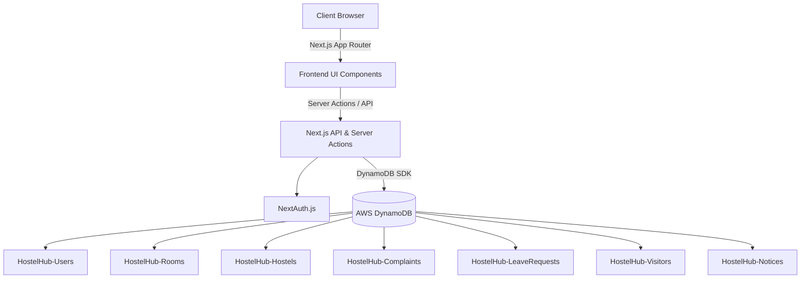

# HostelHub

HostelHub is a modern, comprehensive Hostel Management System built with Next.js 14, React, Tailwind CSS, and AWS DynamoDB. It streamlines hostel operations by handling room allocation, complaints, leave requests, visitor passes, and emergency alerts.

## 🏗 Architecture Diagram



## 🚀 Setup Guide

### Prerequisites
- Node.js 18.x or later
- An AWS Account with DynamoDB access
- AWS CLI configured locally (for local development)

### Local Development
1. Clone the repository:
   ```bash
   git clone https://github.com/your-username/hostelhub.git
   cd hostelhub
   ```
2. Install dependencies:
   ```bash
   npm install
   ```
3. Set up your environment variables (see below).
4. Run the development server:
   ```bash
   npm run dev
   ```
5. Open [http://localhost:3000](http://localhost:3000) with your browser.

## 🗄 AWS DynamoDB Configuration Guide

HostelHub relies entirely on DynamoDB for data persistence. You will need to create the following tables in your AWS Console (Primary Key is `id` of type String for all tables):

1. **HostelHub-Users**
2. **HostelHub-Hostels**
3. **HostelHub-Rooms**
4. **HostelHub-Complaints**
5. **HostelHub-LeaveRequests**
6. **HostelHub-Visitors**
7. **HostelHub-Notices**
8. **HostelHub-EmergencyAlerts**

*Note: For the MVP, Secondary Indexes (GSIs) are omitted in favor of simple queries and scans, but creating GSIs on fields like `studentId` and `hostelId` is highly recommended for production.*

## 🔑 Environment Variables Documentation

Create a `.env.local` file in the root of your project:

```env
# Next Auth Configuration
NEXTAUTH_URL=http://localhost:3000
NEXTAUTH_SECRET=your_super_secret_key_here

# AWS Configuration
AWS_REGION=us-east-1
AWS_ACCESS_KEY_ID=your_aws_access_key
AWS_SECRET_ACCESS_KEY=your_aws_secret_key

# DynamoDB Table Names (Optional, defaults to these values)
DYNAMODB_TABLE_USERS=HostelHub-Users
DYNAMODB_TABLE_HOSTELS=HostelHub-Hostels
DYNAMODB_TABLE_ROOMS=HostelHub-Rooms
DYNAMODB_TABLE_COMPLAINTS=HostelHub-Complaints
DYNAMODB_TABLE_LEAVES=HostelHub-LeaveRequests
DYNAMODB_TABLE_VISITORS=HostelHub-Visitors
DYNAMODB_TABLE_NOTICES=HostelHub-Notices
DYNAMODB_TABLE_EMERGENCY_ALERTS=HostelHub-EmergencyAlerts
```

## 🌐 API Documentation

HostelHub primarily utilizes **Next.js Server Actions** for internal mutations, but exposes the following standard REST APIs:

### `GET /api/analytics`
Fetches a comprehensive aggregate of all system statistics for the Admin Dashboard.
- **Response**: `200 OK`
- **Body**: 
  ```json
  {
    "kpis": {
      "totalStudents": 150,
      "totalRooms": 60,
      "occupiedRooms": 45,
      "pendingComplaints": 12,
      "activeVisitors": 5
    },
    "charts": {
      "hostelOccupancy": [...],
      "complaintTrends": [...],
      "leaveStats": [...],
      "visitorStats": [...]
    }
  }
  ```
- **Auth required**: Admin Session

### `GET /api/seed`
Injects sample demo data into the configured DynamoDB tables.
- **Response**: `200 OK`
- **Note**: *For hackathon/demo purposes only. Remove before production deployment.*

## 🚢 Deployment Guide (Vercel)

HostelHub is optimized for seamless deployment on Vercel.

1. Push your code to a GitHub repository.
2. Log into [Vercel](https://vercel.com/) and click **Add New Project**.
3. Import your GitHub repository.
4. In the **Environment Variables** section, copy and paste all the variables from your `.env.local` file.
5. Ensure the Framework Preset is set to **Next.js**.
6. Click **Deploy**.

Vercel will automatically build the project and assign a production URL. Ensure your AWS credentials have the correct IAM permissions for DynamoDB access.
